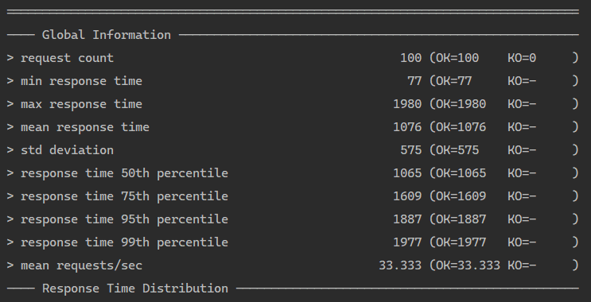
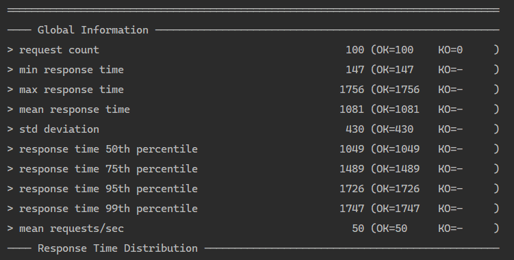
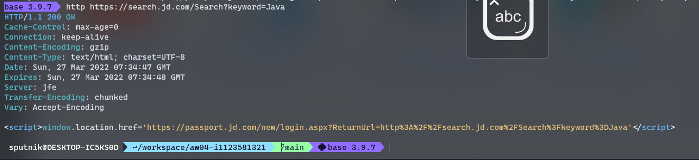
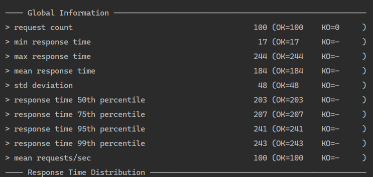

# 可扩展 web 架构

## 基础测试

直接将 app 打包为镜像，为其分配一个 cpu，使用 gatling 对其进行 load testing

发出 100 个请求，结果如下

平均响应时间约 1s

## 水平扩展

配置 haproxy，使用 4 个分配了 0.5 个 cpu 的容器进行测试

可以看出平均响应时间基本没有变化，猜想是因为每次请求都要获取京东的数据，网络通信带来的延迟抹平了水平扩展的效果。

## 加入缓存

此时可能是因为测试次数过多导致触发了京东需要登录的需求

更换了另一台机器，直接运行程序并进行压力测试，发出 100 个请求

可以看出将爬取京东获取的商品内容进行缓存后能带来较大的性能提升，相应的后果是不会实时显示搜索到的信息，需要等到缓存失效后才会再次进行爬取

试着将 h2 database 更换为容器中的 mysql，性能并没有产生显著变化。猜想是因为测试规模不够大，在 session 存储方面没有到达瓶颈
