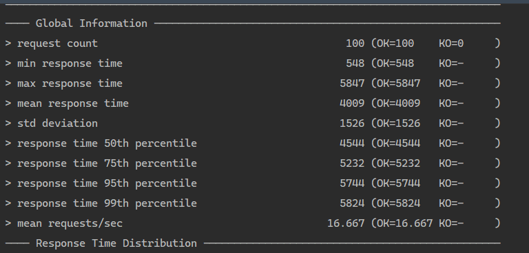

# 可扩展 web 架构

## 基础测试

直接将 app 打包为镜像，为其分配0.5 cpu，使用 gatling 对其进行 load testing

这里为了避免京东对请求进行限制，使用了 cookie

发出 100 个请求，结果如下

平均响应时间约 4 秒

## 水平扩展

配置 haproxy，使用 4 个分配了 0.5 个 cpu 的容器进行测试

可以看出平均响应时间取得了提升，与水平扩展的程度基本一致

## 缓存与会话管理

将比较耗时的请求商品部分设置为可缓存，再次进行测试

可以看出提升不大，猜想是因为主要耗时的是图片的加载，在获取商品列表时只获得了图片 url，请求主页时图片需要重新下载

加入会话管理，使得每次请求对应一个购物车，使用一个 mysql 容器作为会话信息的存储。每次进行操作都会重定位到首页，如果没有加入会话一致性，则重定位请求会被转发到其他服务器导致购物车内容不能被共享，而加入外部数据库存储后可以看出多次请求购物车内容都能保证一致

进入容器中查看表内容，可以看到 SESSION 信息确实被存储到了数据库中

